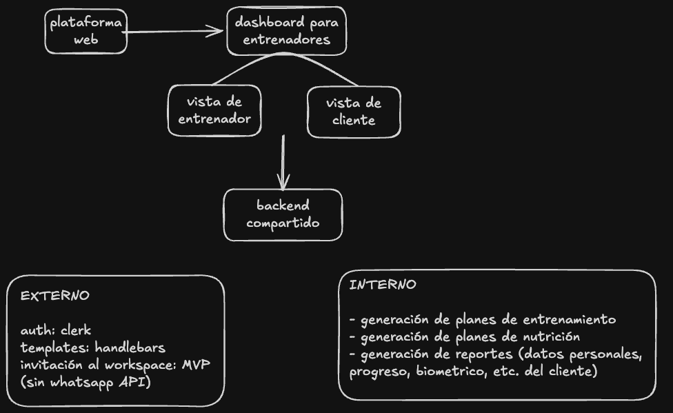
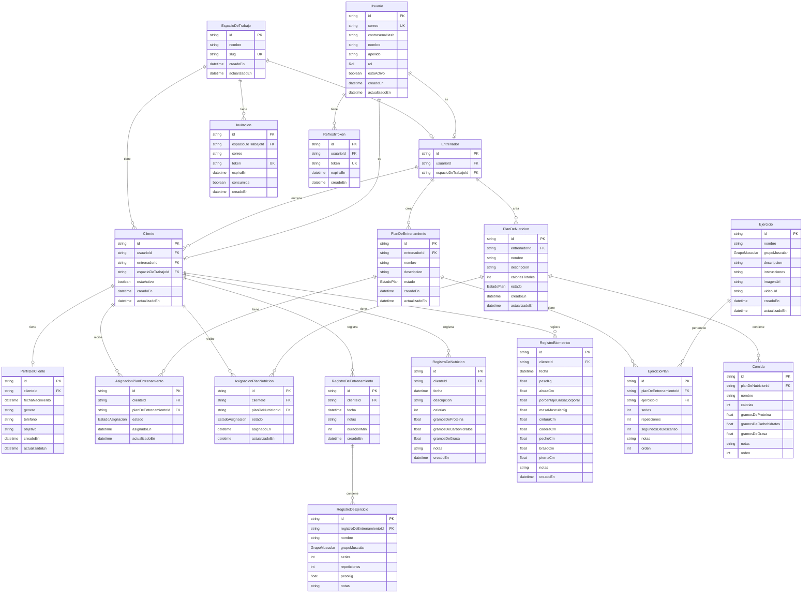

## Fase de Descubrimiento y Análisis de Negocio

### Paso 1: Definir el "Core" o núcleo del negocio
El primer paso es entender la razón de existir del proyecto antes de escribir una sola línea de código. Debes sentarte a responder qué problema exacto resuelve este proyecto y cómo genera valor o dinero. Tienes que poder explicar el modelo de negocio en una sola frase sencilla. Además, es vital identificar cuál es la métrica de éxito principal, ya sea cantidad de usuarios activos, volumen de ventas o reducción de tiempos en un proceso.

 #### RTA//
 Plataforma SaaS que permite a entrenadores personales independientes gestionar clientes, planes de entrenamiento, nutrición y biometría desde un solo lugar.
 
 Actualmente los entrenadores personales/independientes, los cuales no necesariamente estan en gimnasios comerciales, tienen la dificultad de centralizar todos sus clientes. Lo realizan por whatsapp, notas de telefono, o apps por el estilo. El proyecto consta de una app para centralizar los clientes de un entrenador, permitiendo centralizar no solo la gestion, sino tambien los datos de los entrenamientos, postear un plan de entrenamiento personalizado, recomendaciones nutricionales, informacion de biometrico del cliente. Esto facilita la gestion de todos los clientes, por lo que la forma de remuneracion economica seria por medio de planes, donde el entrenador tiene un numero limitado de clientes para poder ingresar a su espacio de trabajo, el cual con diferentes "pagos/suscripciones" puede aumentar. 

### Paso 2: Identificar los actores y sus motivaciones
Todo sistema es operado o consumido por alguien. Debes listar todos los tipos de usuarios que interactuarán con el producto. No te limites solo al cliente final; incluye administradores, soporte técnico, proveedores o sistemas externos. Para cada actor, define qué dolor tiene, qué objetivo principal busca lograr al usar el sistema y qué nivel de conocimiento tecnológico posee, ya que esto impactará directamente el diseño de la interfaz y la experiencia.
#### RTA//
Los usuarios que interactuaran con el sistema son:
- Entrenadores
  - Dolor actual: falta de centralizacion de sus clientes y datos
  - objetivo principal: facil acceso a datos de clientes (nutricion, biometrico, progreso en los entrenamientos) y posteo de recomendaciones de nutricion y planes de entrenamiento
  - nivel de conocimiento tecnologico: bajo-medio, se quiere brindar la simplicidad de uso sin dejar a un lado la entrega informacion detallada
- Clientes del entrenador
  - Dolor actual: la necesidad de estar constantemente en contacto con el entrenador para intercambiar datos, progreso, dudas, nuevos entrenamientos
  - objetivo principal: gestionar e introducir sus datos personales y de entrenamiento con el fin de que el entrenador pueda visualizarlos ahi mismo
  - nivel de conocimiento tecnologico: bajo-medio, se quiere brindar la simplicidad de uso sin dejar a un lado la entrega informacion detallada
Los agentes externos son:
- sistemas externos -> Clerk para autenticacion. Handlebars para templates de reportes. Mailtrap para envio de correos. Postgres para la base de datos con Prisma para la comunicacion. Para la validacion de los inputs se utilizara el class-validator integrado de NestJS.

### Paso 3: Trazar el "Happy Path" o flujo ideal principal
El "Happy Path" es el viaje perfecto que hace un usuario desde que entra al sistema hasta que cumple su objetivo, sin que ocurra ningún error. Debes narrar este proceso paso a paso como si fuera un cuento. Por ejemplo, en un e-commerce, el flujo ideal sería: el usuario busca un producto, lo añade al carrito, ingresa su tarjeta, el sistema aprueba el pago, y se genera un recibo. Mapear este recorrido te dará la columna vertebral de las funcionalidades que tienes que construir obligatoriamente.
#### RTA//
El entrenador ingresa a su Workspace donde puede visualizar sus clientes con datos importantes como nombre, fecha del ultimo entrenamiento registrado en el sistema, numero de contacto, correo, imagen de perfil, etc. Posteriormente, puede hacer click en cualquier cliente y podra ver con mucho mas detalle datos como biometrico, plan de nutricion actual, planes de entrenamiento y progreso. Todo esto en diferentes vistas pero dentro del mismo dashboard.

El cliente ingresa a la invitacion del workspace (si no ha ingresado previamente al workspace). Despues aparece en su pagina de perfil donde colocara sus datos personales de contacto, nombre y eso. Al finalizar el onboarding, el cliente podra (en diferentes vistas) observar los planes de entrenamiento y de nutricion que su entrenador le ha recomendado, diligenciar datos de salud (biometrico).

##### la asignación y ejecución de un plan
1. Entrenador crea un plan de entrenamiento con ejercicios
2. Entrenador asigna el plan al cliente
3. Cliente lo ve al entrar
4. Cliente ejecuta el entrenamiento y registra sus resultados
5. Entrenador visualiza el progreso del cliente

### Paso 4: Levantar las reglas de negocio y los casos de borde
Aquí es donde los proyectos suelen fallar si no se analizan bien. Una vez que tienes el flujo ideal, debes preguntarte todo lo que podría salir mal o las restricciones que impone la realidad. Tienes que definir reglas estrictas, como por ejemplo si un usuario puede tener dos cuentas con el mismo correo, qué sucede si un pago es rechazado pero el producto ya se descontó, o qué límites de tiempo existen para hacer una acción. Estas reglas son las que luego se convertirán en validaciones "if/else" en el código de tu backend.
#### RTA//
Reglas de negocio:
- el entrenador es el dueño del workspace y paga; cada entrenador tiene **un** workspace propio; los clientes sólo acceden por invitación
- un cliente pertenece a un único workspace
- planes (entrenamiento y nutrición) se crean por entrenador y se asignan a clientes
- un cliente puede tener varios planes de entrenamiento (pierna, hombre, tricep, etc.)
- los registros (workout/nutrition/biometría) pertenecen al cliente y se usan para visualizar progreso y generar resúmenes.
- todos los campos que ingresa el entrenador y cliente deben tener validacion para que no ingrese tipos de dato erroneos (ej. numeros en el campo de correo, o texto en el campo de ritmo cardiaco)
- el sistema realiza reportes en HTML de datos personales, progreso, etc.

Edge cases probables:
- invitación inválida/expirada/duplicada. La invitacion tiene un tiempo de expiracion de 24h, al ser consumida no podra ser utilizada de nuevo. Si esta invalida el usuario debera pedir una nueva invitacion al entrenador (fuera del alcance).
- cliente invitado a dos workspaces: se consultara al cliente si quiere realizar el cambio al nuevo workspace, y en caso que desee, se le realizara el mismo proceso de onboarding que en el workspace anterior. Mientras tanto, en el workspace que abandono, se le marcara como inactivo.
- cliente sin plan asignado pero con registros: no puede ocurrir esto, los registros son de los resultados al finalizar cada uno de los planes de entrenamiento.
- si un entrenador archiva o desactiva un plan que ya tiene registros asociados, se deben mantener los registros visibles y vinculados al plan desactivado.
- biometría con unidades distintas o valores fuera de rango: validar al momento en el que el cliente ingrese los datos a los campos.
- entrenador intentando ver/modificar datos de clientes de otro workspace: esto se soluciona con multi-tenancy
- eliminacion de cliente con historial: debe ser un soft-delete
- cambio de entrenador o cierre de workspace con clientes activos: eliminacion total del workspace (no soft-delete) y al cambiar el entrenador, este debera crear su propio workspace

### Paso 5: Definir el ciclo de vida de las entidades principales
Identifica el "sustantivo" más importante de tu modelo de negocio (puede ser una Reserva, un Pedido, un Ticket, un Contrato). Una vez identificado, dibuja cómo cambian sus estados a lo largo del tiempo. Un Pedido, por ejemplo, nace como "Pendiente", luego pasa a "Pagado", después a "En Preparación" y finalmente a "Entregado" o "Cancelado". Entender estos estados es fundamental porque dictarán cómo se comporta la base de datos y la interfaz de usuario en cada momento.
#### RTA//
Plan:
- estados: borrador -> activo: solo el entrenador, cuando tiene al menos 1 ejercicio -> archivado/cancelado: solo el entrenador, se puede archivar con asignaciones activas
Cliente:
- estados: invitado -> onboarding -> activo -> inactivo: el entrenador manualmente, o el sistema automáticamente si el cliente cambia de workspace
Suscripcion:
- estados: trial -> activa -> vencida/cancelada

**Nota sobre Suscripción (Simulada):**
Dado que el sistema se encuentra en fase de desarrollo MVP, el proceso de suscripción será **simulado**. No se implementará lógica de cobro ni integración con servicios de pago externos (como Stripe, PayPal, etc.). 

El comportamiento simulado será:
- Cuando un entrenador complete el proceso de suscripción, el sistema mostrará un mensaje confirmando la suscripción al plan seleccionado (ej. "Entrenador suscrito al plan X").
- El estado de la suscripción en la base de datos se actualizará directamente a "activa" sin procesar ningún pago real.
- Esta simulación permite desarrollar y probar el flujo completo de la aplicación sin depender de servicios externos de pago.

La integración real con pasarelas de pago externas queda pendiente para una fase posterior del proyecto.
## Fase de System Design y Arquitectura

### Paso 6: Bocetar los componentes de alto nivel
Con el negocio claro, ahora pasas a la tecnología dibujando unas cajas simples que representan las piezas del rompecabezas. Debes decidir si tendrás una aplicación móvil, una plataforma web, un panel administrativo separado de la vista del cliente, y un backend central. También es el momento de identificar si necesitarás servicios de terceros, como pasarelas de pago externas, servicios de envío de correos electrónicos o proveedores de mapas.

#### RTA//

- Tambien como servicio externo se usara mailtrap para el envio de correos de invitacion de clientes al workspace
- Postgres para la base de datos con Prisma para la comunicacion
- bcrypt para hasheo de passwords

### Paso 7: Diseño del modelo de datos
El modelo de datos es la base de la verdad de tu sistema. Toma los sustantivos y estados que identificaste en el análisis de negocio y tradúcelos a entidades o tablas. Debes decidir qué información necesita guardarse de manera permanente y cómo se relacionan entre sí. Aquí es donde decides si el proyecto requiere una base de datos relacional para datos altamente estructurados y transaccionales, o una base de datos documental si requieres esquemas más flexibles.

#### RTA//


### Paso 8: Definir los contratos de comunicación (APIs)
Los distintos componentes que dibujaste deben hablar entre sí de manera ordenada. Tienes que definir cómo el frontend le pedirá información al backend. Determina los endpoints principales que soportarán el "Happy Path" que trazaste al inicio. Al definir qué datos se envían en una petición y qué formato tendrá la respuesta, permites que los equipos de frontend y backend (o tú mismo en distintas etapas) puedan trabajar de forma independiente.

#### RTA//
- Todos los endpoints tendran en prefijo /api
```markdown
# API REST - Fitness SaaS

## Autenticación
| Método | Endpoint | Descripción | Request Body | Respuesta |
|--------|----------|--------------|--------------|-----------|
| POST | /auth/register | Registro de entrenador | `{ correo, contrasena, nombre, apellido }` | `{ token, usuario }` |
| POST | /auth/login | Login | `{ correo, contrasena }` | `{ token, usuario }` |
| POST | /auth/logout | Logout | - | `{ mensaje }` |
| POST | /auth/refresh | Refrescar token | `{ refreshToken }` | `{ token }` |

---

## Workspace
| Método | Endpoint | Descripción | Request Body | Respuesta |
|--------|----------|--------------|--------------|-----------|
| GET | /workspaces/:id | Obtener workspace | - | `{ workspace, entrenador }` |
| PUT | /workspaces/:id | Actualizar workspace | `{ nombre }` | `{ workspace }` |

---

## Clientes
| Método | Endpoint | Descripción | Request Body | Respuesta |
|--------|----------|--------------|--------------|-----------|
| GET | /clientes | Listar clientes del entrenador | - | `{ clientes[] }` |
| GET | /clientes/:id | Ver detalle de cliente | - | `{ cliente, perfil, planes, registros }` |
| POST | /clientes/invitar | Invitar cliente | `{ correo }` | `{ tokenInvitacion }` |
| POST | /clientes/register | Registro de cliente (con invitación) | `{ tokenInvitacion, correo, contrasena, nombre, apellido }` | `{ token, cliente }` |
| PUT | /clientes/:id | Actualizar cliente | `{ estaActivo }` | `{ cliente }` |
| DELETE | /clientes/:id | Eliminar cliente (soft-delete) | - | `{ cliente }` |

---

## Perfil del Cliente
| Método | Endpoint | Descripción | Request Body | Respuesta |
|--------|----------|--------------|--------------|-----------|
| GET | /clientes/:id/perfil | Ver perfil | - | `{ perfil }` |
| PUT | /clientes/:id/perfil | Actualizar perfil | `{ fechaNacimiento, genero, telefono, objetivo, notas }` | `{ perfil }` |

---

## Planes de Entrenamiento
| Método | Endpoint | Descripción | Request Body | Respuesta |
|--------|----------|--------------|--------------|-----------|
| GET | /planes-entrenamiento | Listar planes del entrenador | - | `{ planes[] }` |
| GET | /planes-entrenamiento/:id | Ver plan con ejercicios | - | `{ plan, ejercicios[] }` |
| POST | /planes-entrenamiento | Crear plan | `{ nombre, descripcion }` | `{ plan }` |
| PUT | /planes-entrenamiento/:id | Actualizar plan | `{ nombre, descripcion, estado }` | `{ plan }` |
| DELETE | /planes-entrenamiento/:id | Eliminar plan | - | `{ mensaje }` |

---

## Ejercicios del Plan
| Método | Endpoint | Descripción | Request Body | Respuesta |
|--------|----------|--------------|--------------|-----------|
| POST | /planes-entrenamiento/:id/ejercicios | Agregar ejercicio | `{ ejercicioId, series, repeticiones, segundosDeDescanso, orden, notas }` | `{ ejercicioPlan }` |
| PUT | /planes-entrenamiento/:id/ejercicios/:ejercicioId | Actualizar ejercicio | `{ series, repeticiones, segundosDeDescanso, orden, notas }` | `{ ejercicioPlan }` |
| DELETE | /planes-entrenamiento/:id/ejercicios/:ejercicioId | Quitar ejercicio | - | `{ mensaje }` |

---

## Planes de Nutrición
| Método | Endpoint | Descripción | Request Body | Respuesta |
|--------|----------|--------------|--------------|-----------|
| GET | /planes-nutricion | Listar planes del entrenador | - | `{ planes[] }` |
| GET | /planes-nutricion/:id | Ver plan con comidas | - | `{ plan, comidas[] }` |
| POST | /planes-nutricion | Crear plan | `{ nombre, descripcion, caloriasTotales }` | `{ plan }` |
| PUT | /planes-nutricion/:id | Actualizar plan | `{ nombre, descripcion, caloriasTotales, estado }` | `{ plan }` |
| DELETE | /planes-nutricion/:id | Eliminar plan | - | `{ mensaje }` |

---

## Comidas del Plan
| Método | Endpoint | Descripción | Request Body | Respuesta |
|--------|----------|--------------|--------------|-----------|
| POST | /planes-nutricion/:id/comidas | Agregar comida | `{ nombre, calorias, gramosDeProteina, gramosDeCarbohidratos, gramosDeGrasa, orden, notas }` | `{ comida }` |
| PUT | /planes-nutricion/:id/comidas/:comidaId | Actualizar comida | `{ nombre, calorias, gramosDeProteina, gramosDeCarbohidratos, gramosDeGrasa, orden, notas }` | `{ comida }` |
| DELETE | /planes-nutricion/:id/comidas/:comidaId | Quitar comida | - | `{ mensaje }` |

---

## Asignaciones
| Método | Endpoint | Descripción | Request Body | Respuesta |
|--------|----------|--------------|--------------|-----------|
| POST | /asignaciones/entrenamiento | Asignar plan entrenamiento | `{ clienteId, planEntrenamientoId }` | `{ asignacion }` |
| POST | /asignaciones/nutricion | Asignar plan nutrición | `{ clienteId, planNutricionId }` | `{ asignacion }` |
| GET | /clientes/:id/asignaciones | Ver asignaciones de cliente | - | `{ asignacionesEntrenamiento[], asignacionesNutricion[] }` |
| PUT | /asignaciones/:id | Cambiar estado de asignación | `{ estado }` | `{ asignacion }` |

---

## Registros de Cliente
| Método | Endpoint | Descripción | Request Body | Respuesta |
|--------|----------|--------------|--------------|-----------|
| POST | /clientes/:id/registros-entrenamiento | Registrar entrenamiento | `{ fecha, duracionMin, notas, ejercicios[] }` | `{ registro }` |
| GET | /clientes/:id/registros-entrenamiento | Ver historial entrenamientos | `?page=&limit=&desde=&hasta=` | `{ registros[], total, page, limit }` |
| POST | /clientes/:id/registros-nutricion | Registrar alimentación | `{ fecha, descripcion, calorias, gramosDeProteina, gramosDeCarbohidratos, gramosDeGrasa, notas }` | `{ registro }` |
| GET | /clientes/:id/registros-nutricion | Ver historial nutrición | `?page=&limit=&desde=&hasta=` | `{ registros[], total, page, limit }` |
| POST | /clientes/:id/registros-biometricos | Registrar biométrico | `{ fecha, pesoKg, alturaCm, porcentajeGrasaCorporal, masaMuscularKg, cinturaCm, caderaCm, pechoCm, brazoCm, piernaCm, notas }` | `{ registro }` |
| GET | /clientes/:id/registros-biometricos | Ver historial biométrico | `?page=&limit=&desde=&hasta=` | `{ registros[], total, page, limit }` |

---

## Progreso y Reportes
| Método | Endpoint | Descripción | Request Body | Respuesta |
|--------|----------|--------------|--------------|-----------|
| GET | /clientes/:id/progreso | Ver progreso general | - | `{ resumenEntrenamientos, resumenNutricion, resumenBiometrico }` |
| GET | /clientes/:id/reportes | Generar reporte HTML | - | `{ html }` |

---

## Ejercicios (Catálogo)
| Método | Endpoint | Descripción | Request Body | Respuesta |
|--------|----------|--------------|--------------|-----------|
| GET | /ejercicios | Listar ejercicios | - | `{ ejercicios[] }` |
| GET | /ejercicios/:id | Ver ejercicio | - | `{ ejercicio }` |
| POST | /ejercicios | Crear ejercicio | `{ nombre, grupoMuscular, descripcion, instrucciones, imagenUrl, videoUrl }` | `{ ejercicio }` |
| GET | /ejercicios/por-grupo/:grupoMuscular | Filtrar por grupo muscular | - | `{ ejercicios[] }` |

---

## Notas
- Todos los endpoints (excepto `/auth/*`) requieren header `Authorization: Bearer <token>`
- Los IDs en la URL son UUIDs
- Las respuestas de error siguen el formato: `{ statusCode, mensaje, error }`
- Paginación: se usa `?page=` y `?limit=` en endpoints de lista
- Filtros por fecha: `?desde=YYYY-MM-DD&hasta=YYYY-MM-DD` en endpoints de historial
```

---

## Suscripción (Futuro - Placeholder)

| Método | Endpoint | Descripción | Request Body | Respuesta |
|--------|----------|--------------|--------------|-----------|
| POST | /suscripcion/planes | Listar planes disponibles | - | `{ planes[] }` |
| POST | /suscripcion/suscribirse | Suscribirse a un plan (simulado en MVP) | `{ planId }` | `{ mensaje, suscripcion }` |
| GET | /suscripcion/actual | Ver suscripción actual | - | `{ suscripcion }` |
| PUT | /suscripcion/cancelar | Cancelar suscripción | - | `{ mensaje, suscripcion }` |

**Nota:** En el MVP, el endpoint `POST /suscripcion/suscribirse` será **simulado**. Retornará un mensaje como "Entrenador suscrito al plan X" y actualizará el estado directamente a "activa" sin procesar pagos reales.

---

## Perfil del Entrenador

| Método | Endpoint | Descripción | Request Body | Respuesta |
|--------|----------|--------------|--------------|-----------|
| GET | /entrenador/perfil | Ver perfil del entrenador | - | `{ usuario }` |
| PUT | /entrenador/perfil | Actualizar perfil | `{ nombre, apellido, telefono }` | `{ usuario }` |

---

## Invitaciones

| Método | Endpoint | Descripción | Request Body | Respuesta |
|--------|----------|--------------|--------------|-----------|
| GET | /invitaciones | Listar invitaciones enviadas | `?consumida=true\|false` | `{ invitaciones[] }` |
| GET | /invitaciones/:token/verificar | Verificar estado de invitación | - | `{ valida, invitacion }` |
| POST | /invitaciones/reenviar | Reenviar invitación | `{ invitacionId }` | `{ invitacion }` |
| DELETE | /invitaciones/:id | Revocar invitación | - | `{ mensaje }` |

### Paso 9: Analizar requerimientos de escala y seguridad
Antes de empezar a programar, debes prever el entorno en el que vivirá el sistema. Pregúntate cuántos usuarios simultáneos esperas tener en el primer año, ya que esto definirá si puedes iniciar con un servidor sencillo o requieres una arquitectura elástica. También debes establecer cómo se manejará la autenticación de los usuarios, cómo se protegerán los datos sensibles y qué estrategia de copias de seguridad implementarás para que el negocio no se detenga ante un desastre.

#### RTA//
```markdown
### Estimación de carga inicial
- MVP: ~50-100 usuarios activos (entrenadores independientes con ~10-20 clientes cada uno)
- Sesiones concurrentes: bajas durante el MVP

### Autenticación y autorización
- **Clerk** como servicio externo de autenticación (manejo de sesiones, OAuth)
- JWT con refresh tokens para API (usando modelo `RefreshToken` del schema)

### Multi-tenancy
- **Implementación en capa de aplicación (Prisma)**
- Cada consulta a la base de datos incluirá filtro por `espacioDeTrabajoId`
- Middleware de NestJS que extrae `workspaceId` del token JWT y lo inyecta en todas las queries
- El entrenador solo puede ver/modificar datos de su propio workspace
- Previene accesos cruzados: `WHERE espacioDeTrabajoId = :workspaceId`

### Validación de datos
- **class-validator** para validación de inputs en DTOs
- Validaciones de tipo (números en campos numéricos, emails con formato válido)
- Validaciones de rango (peso, altura, porcentajes dentro de rangos fisiológicos正常人)
- Enums validados contra los valores permitidos en el schema (Rol, EstadoPlan, GrupoMuscular, EstadoAsignacion)

### Seguridad a nivel de base de datos
- Prisma ORM previene SQL injection nativamente
- CORS configurado para permitir solo orígenes del frontend
- Tokens de invitación con expiración de 24h

### Datos sensibles
- Tokens de invitación un solo uso
- Soft-delete para clientes (preserva historial)
- Tokens JWT con expiración corta (access token: 15min, refresh token: 7 días)

### Paso 10: Priorizar y definir el Producto Mínimo Viable (MVP)
El último paso del diseño es aprender a recortar. Un system design óptimo no intenta construir todo el primer día. Toma todo lo que has analizado y sepáralo en fases de entrega. Identifica cuál es el conjunto mínimo de características que debes desarrollar para comprobar que el negocio funciona y aporta valor. Lo demás deberá quedar documentado en un "backlog" o lista de tareas futuras para iterar sobre el sistema una vez que esté en producción.

#### RTA//
```markdown
## MVP - Fase 1

### Entrenador
| Funcionalidad | Prioridad |
|---------------|-----------|
| Registro/Login con Clerk | Alta |
| Gestión de workspace (automático al registrarse) | Alta |
| Invitar clientes (token + email) | Alta |
| CRUD de clientes | Alta |
| CRUD de planes de entrenamiento | Alta |
| Agregar ejercicios a planes | Alta |
| Asignar planes a clientes | Alta |
| Ver progreso de clientes | Alta |
| Registrar workouts para clientes | Media |

### Cliente
| Funcionalidad | Prioridad |
|---------------|-----------|
| Registro via invitación | Alta |
| Ver planes de entrenamiento asignados | Alta |
| Registrar workouts propios | Alta |
| Ver progreso personal | Media |

### Ambos
| Funcionalidad | Prioridad |
|---------------|-----------|
| Auth con Clerk | Alta |
| Gestión de perfil | Media |

---

## Backlog - Fase 2+
- CRUD de planes de nutrición
- Agregar comidas a planes nutricionales
- Asignar planes de nutrición a clientes
- Registro de nutrición del cliente
- Registro biométrico completo
- Generación de reportes HTML
- Soft-delete de clientes

## Fuera de alcance del MVP
- Pagos integrados (será simulado en MVP)
- Chat en tiempo real
- App móvil nativa
- Inteligencia artificial
- Gamificación
- Analítica avanzada
```
